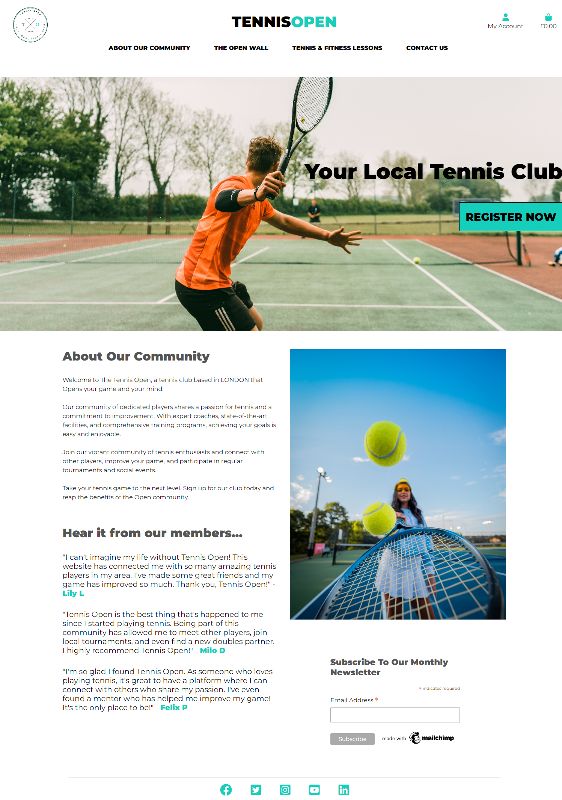
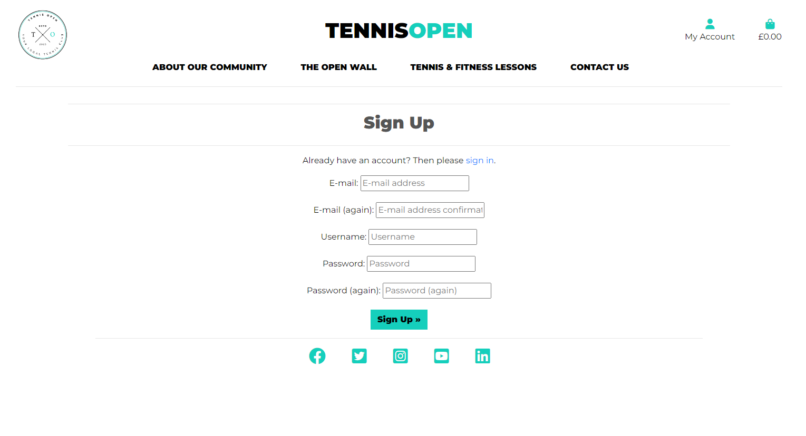
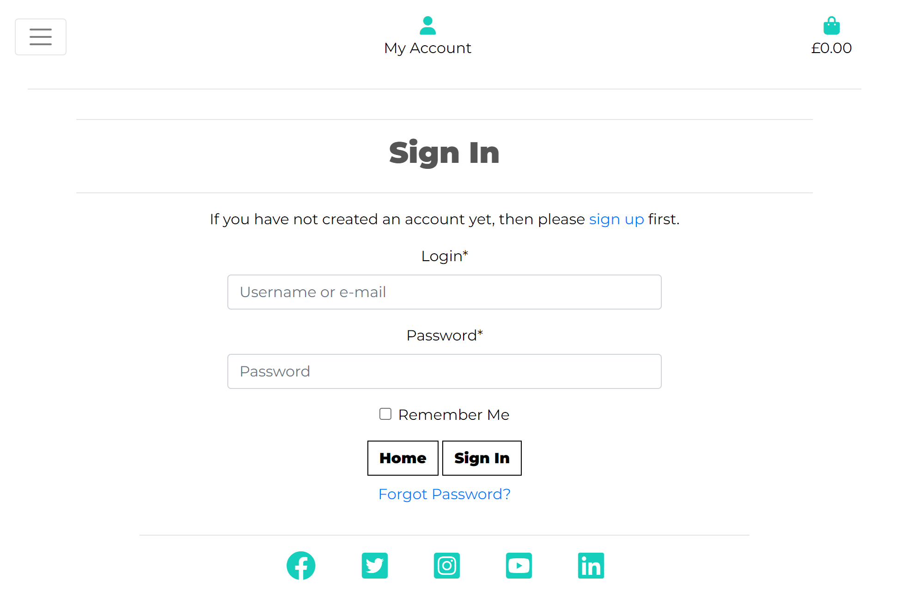

# **TENNIS OPEN**

## <u>1. Introduction</u>
In this project, the objective was to build a Full-Stack site based on business logic used to control a centrally-owned dataset. I will set up an authentication mechanism and provide paid access to the site's data.
I've created a website for a tennis club community based in London called Tennis Open. The site allows users to register an account with the site, purchase tennis lessons and tennis-based fitness session and be part of a community posting comments about their experiences on an 'Open Wall'. Additional features include a contact form that allows users to contact the Tennis Open team to ask any questions, as well as sign up to a monthly newsletter.

## <u>2. User Stories</u>

### As a site user, I want to be able to:

* Read about what the website is about.

* View the tennis and fitness lessons available to purchase.

* Register for an account.

* Access social links of the website.

* Subscribe to a newsletter.

* View the comments on the Open Wall.

* Fill out a contact form to find out more about the club.

### As a registered user, I want to be able to:

* View other people's comments, but won't be able to make any changes to their comments.

* Post comments, and edit and delete my comments on the wall.

* View the orders I've made in a profile page.

* See what I've purchased once I've paid, and get a confirmation sent to my email with a confirmation number.

* View what I'm purchasing before I pay.

* Checkout my bag when I'm ready, and be able to make a payment through an easy to follow form.

* View my bag and remove any items I don't want and to keep shopping if I want to select other items.

* Add tennis and fitness lessons to my bag.

* Log out of my account.

* Easily log in to my account.

* ### **End user goal** 
I want to be able to join an exciting tennis club that allows me to purchase tennis and fitness lessons easily, and be part of an online community sharing our experiences.

* ### **Acceptance criteria**
A fully functioning payment system using Stripe, that allows users to make purchases and receive automated confirmation emails.
An authentication system that allows to register an account, log in and log out of their personal account.
A page that allows users to post comments and communicate with each and share their experiences.
A subscription service that allows users to subscribe to a service using MailChimp.

* ### **Measurement of success**
A profile page that allows registered users to view their purchases and orders.
A contact form that allows users to contact the Tennis Open team to ask any questions.
Functions allows users to edit and delete their comments on the Open Wall.
A safety feature that only allows registered users to post comments.

## <u>3. Features</u>

### **The Open Wall**
A clear and simple home page that captures the look and feel of a high-end Asian-themed restaurant with a hero image in the middle. There's a description of the food at the restaurant and information around how users can find the restaurant and its opening times. 
A navigation bar at the top allows users to view the menu in detail, register an account if they don't have one, or log-in if they do.

### **Tennis and Fitness Lessons**
Users can view the menu from the navigation bar in the header on a separate page, where the restaurant's starters, main and desserts are displayed.

### **Contact Us Form**
If the user does not have an account, they can click the Register button that takes them to the register an account page. Here they can create a username, email (optional), and password to register a new account.

### **Home Page**
If the user already has an account, they can click the Sign-in button where they will be prompted to sign in with their registered username and password.

### **Profile Page**
Once the user has logged in to their account, they can make a new reservation by entering in the details required in the form which includes: name, email, contact number, number of people, date and time.

### **Register for an account**
User can also view their bookings and have the ability to update and delete any existing bookings. To update their bookings, users will be taken to another page where the form reappears that allows them to edit that particular reservation and return them to the view bookings page.

### **Log in**
Users can logout by clicking the logout link, which will take them to a new page that asks them if they're sure that they want to log out. When the user clicks sign out, they will be taken back to the home page and logged out of their account.

### **Log out**
Users can logout by clicking the logout link, which will take them to a new page that asks them if they're sure that they want to log out. When the user clicks sign out, they will be taken back to the home page and logged out of their account.

### **Shopping Bag**
Users can logout by clicking the logout link, which will take them to a new page that asks them if they're sure that they want to log out. When the user clicks sign out, they will be taken back to the home page and logged out of their account.

### **Checkout**
Users can logout by clicking the logout link, which will take them to a new page that asks them if they're sure that they want to log out. When the user clicks sign out, they will be taken back to the home page and logged out of their account.

## <u>4. Future features</u>

* ### **Warning messages**
   To include a feature that flashes a warning message to users before they are about to update and delete a booking, and allows them to confirm or cancel the action.

* ### **Leave a review**
   Once users have logged in, to allow them the ability to leave a review of the restaurant and their dining experience, and for this to be displayed on the home page for new and old users to view and comment on.

* ### **Block double bookings**
   To allow the restaurant to block any double bookings at the same time for the same number of people. Or for the restaurant to specify how many tables are available at a certain time so that it blocks users from making a booking if the tables at the restaurant are full.

## <u>5. Color scheme</u>
I used a mainly blue and red colour scheme with an easy-to-read grey for the text. The red colour is synonymous with Asian culture and symbolises luck and prosperity. The lighter blue adds a nice contrast and fits in with the wall-tile image that is part of the heading of the restaurant. 

## <u>6. Lucidchart</u>
I used lucidchart to structure the restaurant website and its various functions. Taking in the user's journey from the home page through the various options of registering an account to loggin in, and the functions to make a booking, and then to view, update or delete their bookings.

## <u>7. Technology</u>

* <b>HTML:</b> Used to structure the content of my web pages and create the overall layout.

* <b>CSS:</b> Used to style and customize the appearance of my web pages, including the colors, fonts, and layout.

* <b>JavaScript:</b> Used to add interactivity to my web pages, such as form validation and animations.

* <b>Python:</b> Used as the back-end programming language to handle server-side logic, including processing user input, interacting with my database, and generating dynamic content.

* <b>Django:</b> A high-level Python framework used to build the back-end of the website, including handling requests and responses, managing database models, and rendering templates.

* <b>Bootstrap:</b> Used to create a responsive and mobile-friendly user interface, and to take advantage of its pre-built components and styles.

* <b>ElephantSQL:</b> Used to manage and interact with the website's database, including querying data and updating records.

* <b>Gitpod</b> was the application chosen to develop the site.

* The site has been deployed on <b>Heroku</b>. 

## <u>8. Testing</u>

   ### **Code validation**
   The code has been put through the [Python checker](https://www.pythonchecker.com//) and returned minor errors. Most errors contained lines of code that were longer than 79 characters and unnecessary white spaces which have been rectified.

   The CSS code has been checked via the [Jigsaw validator](https://jigsaw.w3.org/css-validator/) with no errors found.

   ### **Test cases**

   * #### <u>Home Page and Menu</u>
      The user is taken to the home page with details of the restaurant displayed. In the header, there are links to the 'Home' page, 'Menu', 'Register', and 'Login'.
      In the footer there are 5 social media links for 'Facebook', 'Twitter', 'Instagram', 'YouTube', 'LinkedIn'. 
      A link to the menu takes the user to a menu page displaying the restaurant's starters, main and desserts. There is a prompt for the user to register an account if they don't have one already, or sign in to an existing account.

   * #### <u>Register An Account</u>
      When the user clicks on the 'register' link, they're taken to a new page which prompts them to input details for 'username', 'email (optional)', 'password' and 'password (again)'. If any of these fields are not filled in or filled in incorrectly, a warning message flashes to fill the field in properly. 
      If all fields have been filled in properly and the user clicks 'sign up', they're taken to the home page with a new navigation bar of options. 
      They can view the 'Menu', 'Make a Booking, 'View Your Bookings' and 'Logout'.

      

   * #### <u>Login</u>
      When the user clicks on the 'login' link, they're taken to a new page which prompts them to input details for 'username' and 'password'. There is also the option for a user to tick the 'Remember Me' box so that their device remembers their login details. Once they click Sign In, they're taken to the home page and their account.

      

   * #### <u>Make A Booking</u>
      When the user is in the 'Make a Booking' page, input fields are displayed for 'Name', 'Email', 'Contact Number', 'Number of People', 'Booking Date' and 'Booking Time'. If any of these fields are not filled in or filled in incorrectly, a warning message flashes to fill the field in properly.
      Once all fields have been filled in correctly and the user clicks submit, they're taken to the 'View Your Bookings' page with a success message of 'Your booking has been made successfully'.

      

   * #### <u>View Your Bookings</u>
      In the 'View Your Bookings' page, the user's new booking will be displayed below which has two button options, one to 'Update' the booking, and one to 'Delete' the booking.
      If a user clicks 'Update', they're taken to a new page with a new form to update the same information fields, and when the user clicks 'Submit', they're taken back to the 'View Your Bookings' page with their booking updated.
      If a user clicks 'Delete', the booking will be deleted immediately and a success message will be displayed indicating which booking has been deleted.

   * #### <u>Logout</u>
      If the user wishes to logout and click the 'Logout' link, they're taken to a new page that asks if the user is sure they want to log out and a 'Sign Out' button. If the 'Sign Out' is clicked, the user is logged out of their account and returned to the home page.

   ### **Fixed bugs**
   * I had not added the '<int:pk>' path converter on my 'update_booking' and 'delete_booking' url paths which meant these pages were not rendering properly and were throwing up errors. These were fixed once the errors were identified.
   
   * In my model I had not included the foreignkey attribute for users and therefore every user could view the same bookings once a new booking was made.

   * In my UpdateBooking view, I hadn't included the primary key from the key word arguments object and therefore the user wasn't able to update their bookings properly as their bookings weren't being retrieved and was throwing an error. This was fixed once the issue had been identified.

   ### **Unfixed bugs**
   There are no known unfixed bugs.
   

## <u>9. Deployment</u>

   ### **Gitpod**
   The site was developed using Gitpod. In order to access the Gitpod workspace, follow the steps below:
   
   1. In Github repository, select the mark3lau/baolau2 project.
   2. Click on the green Gitpod button near the top of the repository page, this will open the Gitpod workspace.
   3. Inside the terminal, you can render the Baolau restaurant website in the browser by typing "python3 manage.py runserver".

   ### **Heroku**
   The site was deployed to Heroku. The steps to deploy are as follows:

   1. In the Heroku dashboard, click on the baolau2 app.
   2. Click on the 'Deploy' tab near the top of the page. 
   3. In the Deploy page, scroll down to the Manual deploy section. Choose the main branch to deploy, and click Deploy Branch. 
   4. Once the message 'Your app was successfully deployed' is displayed, click on the View button below. The app should now be running in a new tab.

## <u>10. Credits</u>

   ### **Harry Potter words**
   The chinese-food image was taken from the [Park Chinois](https://parkchinois.com/) restaurant in Mayfair, London. It was part of their Chinese New Year offering.

   The chinese-wall-tile image was taken from the [Deposit Photos website](https://depositphotos.com/95041990/stock-illustration-vintage-seamless-wall-tiles-of.html).