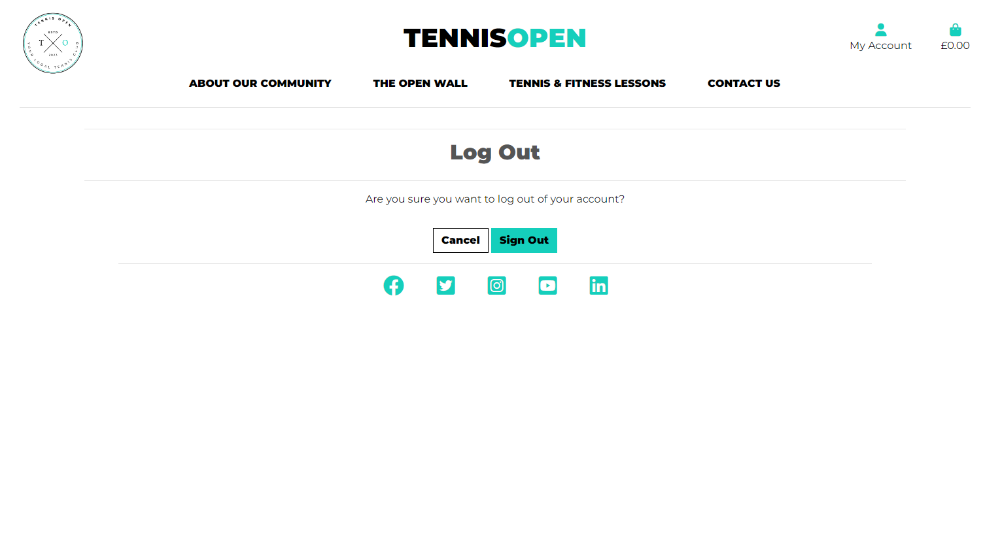

# **TENNIS OPEN**

## <u>1. Introduction</u>
In this project, the objective was to build a Full-Stack site based on business logic used to control a centrally-owned dataset. I will set up an authentication mechanism and provide paid access to the site's data.
I've created a website for a tennis club community based in London called Tennis Open. The site allows users to register an account with the site, purchase tennis lessons and tennis-based fitness session and be part of a community posting comments about their experiences on an 'Open Wall'. Additional features include a contact form that allows users to contact the Tennis Open team to ask any questions, as well as sign up to a monthly newsletter.

## <u>2. User Stories</u>

### As a site user, I want to be able to:

* Read about what the website is about.

* View the tennis and fitness lessons available to purchase.

* Register for an account.

* Access social links of the website.

* Subscribe to a newsletter.

* View the comments on the Open Wall.

* Fill out a contact form to find out more about the club.

### As a registered user, I want to be able to:

* View other people's comments, but won't be able to make any changes to their comments.

* Post comments, and edit and delete my comments on the wall.

* View the orders I've made in a profile page.

* See what I've purchased once I've paid, and get a confirmation sent to my email with a confirmation number.

* View what I'm purchasing before I pay.

* Checkout my bag when I'm ready, and be able to make a payment through an easy to follow form.

* View my bag and remove any items I don't want and to keep shopping if I want to select other items.

* Add tennis and fitness lessons to my bag.

* Log out of my account.

* Easily log in to my account.

* ### **End user goal** 
I want to be able to join an exciting tennis club that allows me to purchase tennis and fitness lessons easily, and be part of an online community sharing our experiences.

* ### **Acceptance criteria**
A fully functioning payment system using Stripe, that allows users to make purchases and receive automated confirmation emails.
An authentication system that allows to register an account, log in and log out of their personal account.
A page that allows users to post comments and communicate with each and share their experiences.
A subscription service that allows users to subscribe to a service using MailChimp.

* ### **Measurement of success**
A profile page that allows registered users to view their purchases and orders.
A contact form that allows users to contact the Tennis Open team to ask any questions.
Functions allows users to edit and delete their comments on the Open Wall.
A safety feature that only allows registered users to post comments.
Messages for successes and errors that notify the user when an action has been executed.

## <u>3. Features</u>

### **Home Page**
A home page that with a header that includes links to the main features of the site. Users can also view their account (if they have logged in) and also their shopping bag if they have added anything into it. A hero image shows what the site is about, with an overlayed register now button that disappears if a user has already logged in. A section stating what the club is all about, followed by quotes from members draws new users into the site. A form allows users to subscribe to a monthly newsletter using MailChimp, and at the bottom users can find the social links to the website's social platforms.

### **The Open Wall**
A clear and simple comment wall that allows users to post comments and view them immediately on the 'wall' on the same page. Registered users can also edit and delete their comments but not other people's.

### **Tennis and Fitness Lessons**
Users can view the tennis and fitness lessons available, with clear borders defining each package and what the user gets and the cost. A highlighted 'Add to Bag' button allows users to add any packages they like into their shopping bag.

### **Contact Us Form**
A simple contact us form allows users to input their name, email, contact number and their message to contact the Tennis Open team. Users will then be directed to a page confirming that the form has been successfully submitted.

### **Register for an account**
Unregistered users can register for a new account, if they have input the correct details they will be taken to a page that tells them to verify their email.

### **Log in**
If users have already registered and are returning to the site, they can login to their account on the login page. If users have forgotten their password, they're taken to a password reset page asking for a verification of their email where they will be sent a link to update their password.

### **Log out**
Users who have already logged in and wish to log out of their account, can do so by clicking the log out button and a warning page double checks to make they would like to continue and log out.

### **Shopping Bag**
Users can view items they have added on their shopping bag page, where it shows what's in their bag, the cost and whether they would like to continue shopping or checkout.

### **Checkout**
Once users have decided they want to continue to checkout and purchase the items in their bag, they are taken to a checkout page to fill in their delivery details and credit card details. If all details are correct and they confirm their order, they are taken to a confirmation page confirming their order, with their purchase details outlined and a confirmation number sent to their email address.

### **Profile Page**
Once a user has logged in, they will be able to view their purchases in a profile page and click on their orders to view details on delivery and cost.

### **Sitemap.xml**
The sitemap.xml file provides a structured list of all the pages on your website, helping search engines crawl and index your content more effectively.

## <u>4. E-commerce Business Model and Marketing Strategy
Tennis Open, an e-commerce platform dedicated to tennis and fitness lessons, embraces an innovative business model that incorporates effective marketing strategies while keeping SEO in mind. With its name, Tennis Open cleverly integrates SEO thinking by leveraging the term "open," synonymous with prestigious tennis Grand Slam tournaments, to optimize search results on platforms like Google.

1. Mailchimp. At the heart of Tennis Open's marketing efforts is the implementation of a Mailchimp subscription newsletter. By encouraging users to subscribe, Tennis Open builds a dedicated community of tennis enthusiasts who receive regular updates, exclusive offers, and valuable content related to tennis and fitness. This newsletter acts as a powerful tool for customer retention and re-engagement, ensuring users stay informed and engaged with the latest news and promotions.

2. Contact Us form. Tennis Open also fosters direct communication with its users through a contact us form, providing a seamless avenue for personalized interactions, addressing inquiries, feedback, and concerns promptly. By offering exceptional customer support, Tennis Open strives to build trust, strengthen relationships, and encourage repeat business.

3. The Open Wall. The platform's "Open Wall" feature enables users to share experiences and connect with other tennis enthusiasts, fostering a sense of community and user-generated content. This social aspect of the website further enhances engagement and enriches the overall user experience.

4. Stripe. To facilitate the purchase of tennis and fitness lessons, Tennis Open employs a secure and user-friendly e-commerce system. Users can easily browse through available lessons, select their preferences, and complete the purchase process, ensuring a seamless and convenient buying experience through the implementation of the Stripe payment system.

Through its thoughtful integration of SEO, impactful marketing strategies, and user-centric features, Tennis Open establishes itself as a premier destination for tennis enthusiasts seeking high-quality lessons and a vibrant community. By continuously refining its offerings and engaging with its user base, Tennis Open aims to solidify its position as a leading player in the online tennis education and community space.

## <u>4. Future features</u>

* ### **Tennis Courts bookings**
   An added feature that allows users to book tennis courts. And an additional bonus would allow registered users priority booking on tennis courts versus users who haven't registered.

* ### **Discounts**
   A discount feature that allows users to get discounts on tennis lessons if sales are low, and/or discounts for long-term users who have been part of the site for a certain length of time.

* ### **Tennis Products for sale**
   Sell tennis products such as tennis racquets, tennis balls, sweat bands and other apparel. 

* ### **Like Button**
   Allow registered users the chance to like other people's comments and increase the comaraderie of the Tennis Open community.

* ### **Post Photos**
   Allow users to post photos as well as comments on the wall. An additional feature could allow users to sell any second tennis products that they have on the Open Wall, making it a community market place.

* ### **Management Page**
   A feature to allow the superuser and management of the site to add additional packages and products through a dedicated page without going into the admin site.

## <u>5. Facebook Page</u>
I've created a dedicated Facebook page for this website for users to easily interact with the Tennis Open community. 

## <u>6. Color scheme</u>
I've used a few simple colours to keep the site as clean as possible, with the splash of turquoise green giving the site a bit of lift and colour. A grey colour for some of the text is preferred as it's easier to read and better on the eye. Other areas I've used black as it contrasts better with the turquoise colour than using the grey. A light blue and light pink colour are used for the edit and delete buttons to add an extra layer of colour to the page and highlight those functions.

## <u>7. Lucidchart</u>
I used lucidchart to structure the layout of my website and its various pages and functions. Starting the user's journey on the home page, we first identify the navigation bar options:

1. About Our Community
2. The Open Wall
3. Tennis and Fitness Lessons
4. Contact Us

We go through the various pages and options that the user has on each page, through to the shopping bag, checkout and confirmation pages.

It helped to visualize and problem solve some of the issues I may have encountered and identified the areas where additional code was needed to better serve the user.

## <u>8. Technology</u>

* <b>HTML:</b> Used to structure the content of my web pages and create the overall layout.

* <b>CSS:</b> Used to style and customize the appearance of my web pages, including the colors, fonts, and layout.

* <b>JavaScript:</b> Used to add interactivity to my web pages, such as form validation and animations.

* <b>Python:</b> Used as the back-end programming language to handle server-side logic, including processing user input, interacting with my database, and generating dynamic content.

* <b>Django:</b> Used to build the back-end of the website, including handling requests and responses, managing database models, and rendering templates.

* <b>Bootstrap:</b> Used to create a responsive and mobile-friendly user interface, and to take advantage of its pre-built components and styles.

* <b>ElephantSQL:</b> Used to manage and interact with the website's database, including querying data and updating records.

* <b>Cloudinary:</b> A cloud-based media management platform that enables efficient storage, optimization, and delivery of images and videos for my website.

* <b>Stripe:</b> A payment processing platform that allows my website to securely accept online payments from customers.

* <b>Gitpod</b> was the application chosen to develop the site.

* <b>Heroku:</b> My site has been deployed on Heroku, a cloud platform that enables me to deploy, manage, and scale my web application easily and efficiently.

## <u>9. Testing</u>

   ### **Code validation**
   1. Using Flake8 in the terminal, there were no major issues flagged in the code.

   2. The CSS code has been checked via the [Jigsaw validator](https://jigsaw.w3.org/css-validator/) with no errors found.

   ### **Test cases**

   * #### <u>Test Cases for the Tennis Lessons and Bag Apps</u>
      Test cases were done on the tennis lessons and bag apps to check that the user can view the packages on the page, check if the selected package has been added to the bag, and to check if the package has been added within the context.

   * #### <u>The Open Wall</u>
      An unregistered user would not be able to post any comments on the wall, a safety mechanism only allows users who have logged in to post comments.
      A second feature only allows users to edit and delete their own comments, rather than any comments that have been posted on the wall.

      
      

   * #### <u>Register button</u>
      If a user has already logged in, they will not be shown the register now button which would have been confusing and counterproductive.

      

   * #### <u>Login</u>
      When the user clicks on the 'login' link, they're taken to a new page which prompts them to input details for 'username' and 'password'. There is also the option for a user to tick the 'Remember Me' box so that their device remembers their login details. Once they click Sign In, they're taken to the home page and their account.

      

   * #### <u>Logout</u>
      If the user wishes to logout and click the 'Logout' link, they're taken to a new page that asks if the user is sure they want to log out and a 'Sign Out' button. If the 'Sign Out' is clicked, the user is logged out of their account and returned to the home page.

   ### **Fixed bugs**
   * I had initially not included an if clause on the home page in the register button section, where registered users could still see the Register Now button, that was quickly resolved.
   
   * In the Open Wall, I hadn't initially included the int:pk in my urls for the edit and delete buttons and so they weren't linking up properly.

   * When it came to deployment, I had forgotten to add my Stripe Secret Key, Stripe Public Key and Web Hook Secret into my env.py file, and I had trouble deploying this onto heroku. This was rectified when these were included in my env.py file and in my heroku config vars.

   ### **Unfixed bugs**
   There are no known unfixed bugs.
   

## <u>10. Deployment</u>

   ### **Gitpod**
   The site was developed using Gitpod. In order to access the Gitpod workspace, follow the steps below:
   
   1. In Github repository, select the mark3lau/tennis_open project.
   2. Click on the green Gitpod button near the top of the repository page, this will open the Gitpod workspace.
   3. Inside the terminal, you can render the Tennis Open website in the browser by typing "python3 manage.py runserver".

   ### **Heroku**
   The site was deployed to Heroku. The steps to deploy are as follows:

   1. In the Heroku dashboard, click on the tennis-open app.
   2. Click on the 'Deploy' tab near the top of the page. 
   3. In the Deploy page, scroll down to the Manual deploy section. Choose the main branch to deploy, and click Deploy Branch. 
   4. Once the message 'Your app was successfully deployed' is displayed, click on the View button below. The app should now be running in a new tab.

## <u>11. Credits</u>

   ### **Code**
   The code to implement the stripe payment system, the checkout app and basic structure of the bag were taken from the Code Institute walk-through project Boutique Ado.
   
   ### **Images**
   The images of the two tennis players and the tennis girl, both featured on the home page, were taken from [Unsplash](https://unsplash.com/s/photos/tennis).
   
   ### **Logo**
   The logo of the website was designed using the free site [Canva](https://www.canva.com/logos/).
   